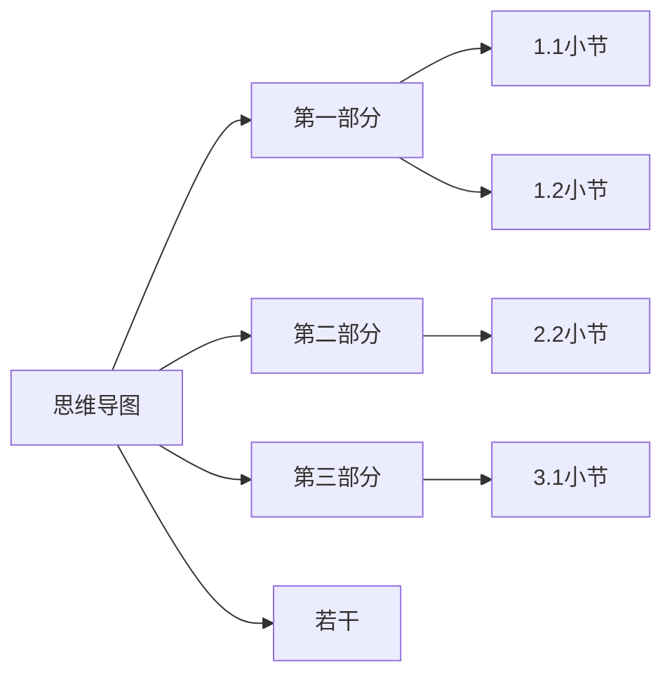
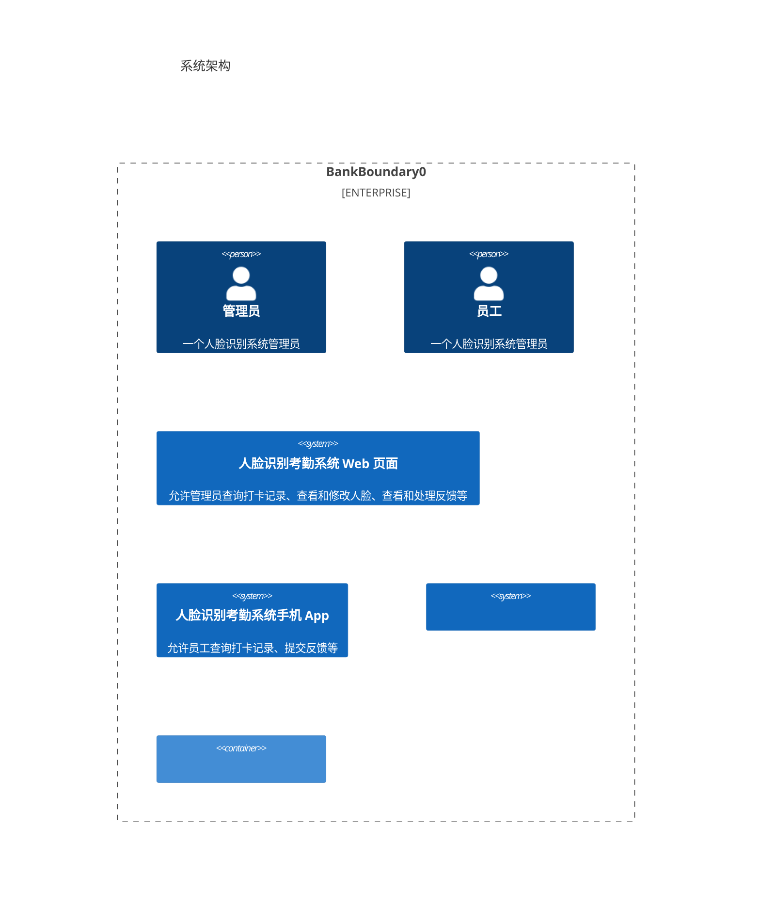

# 人脸识别考勤系统

## 项目技术栈

- C++
- OpenCV
- React
- TypeScript
- Less
- QML
- Redis


## 系统功能结构图



## 系统架构



## 项目开发流程

```mermaid
gantt
dateFormat YYYY-MM-DD

section 项目A
任务1 :a1, 2018-06-06, 30d
任务2 :after a1 , 20```
