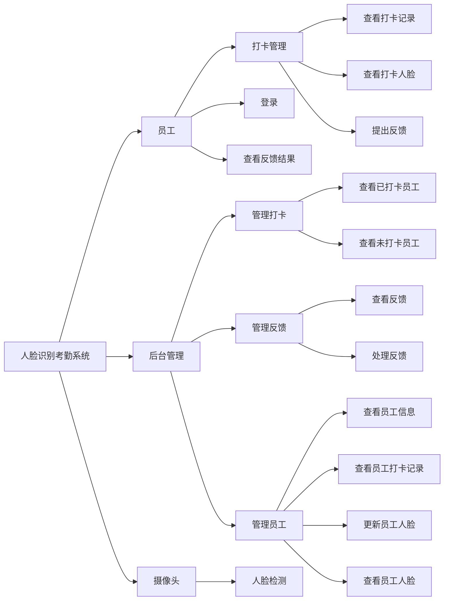
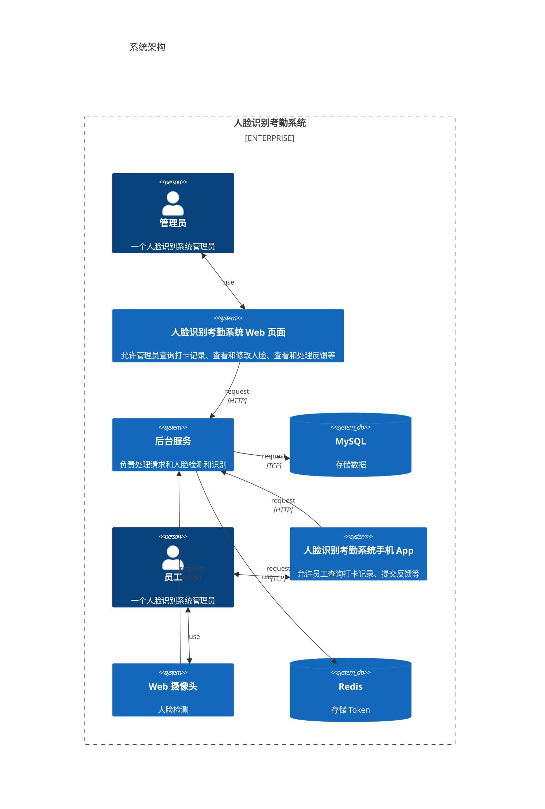
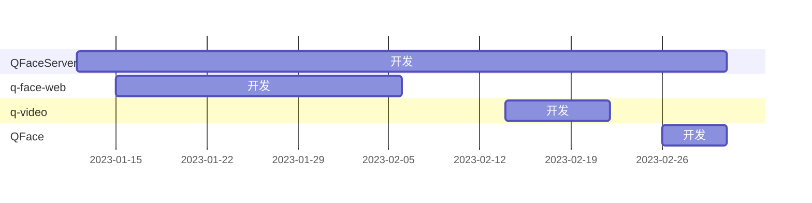

# 人脸识别考勤系统

## 项目技术栈

- C++
- OpenCV
- React
- TypeScript
- Flutter
- Redis

## 仓库说明

```text
q-video：Web 摄像头
q-face-web：管理员 Web 界面
QFaceServer：后台服务
q-face-app：员工 App
```

## 系统功能结构图



## 系统架构



## 项目开发进度


